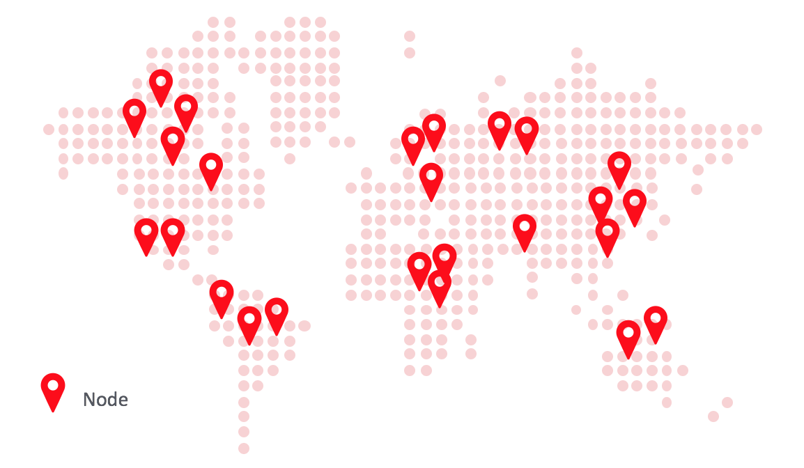

# Introduction to Corda Network

Welcome to Corda Network's website.

[Corda Network](https://corda.network/) is a publicly-available internet of Corda nodes operated by network participants. Each 
node is identified by a certificate issued by the network's identity service, and will also be identifiable on a network map. 

Corda Network enables interoperability – the exchange of data or assets via a secure, efficient internet layer – in a way 
that isn't possible with separate, isolated Corda networks. A common trust root surrounds all transactions, and a consistent set of network parameters ensures all participants may transact with each other.

The network went live in January 2019, and is governed by an independent, not-for-profit foundation. In Spring 2019, a [transitional board](https://corda.network/governance/board-election.html) of participants was elected, which will oversee the foundation until democratic elections are held a year later. See the [governance model](../governance/governance-guidelines.md) for more detail.

The network supports many sub-groups of participants running particular CorDapps (sometimes referred to as 'business networks'), and these groups will often have a co-ordinating party (the 'business network operator') who manages the distribution of the app and rules, including membership, for its use. There is a clear separation between areas of control for the network as a whole and for individual business networks. Like the internet, Corda Network intends to exist as a background utility.

The main benefit of Corda Network for participants is being able to move cash, digital assets, and identity data from one application or line of business to another. Business network operators also benefit by being able to access network-wide services, and reuse the [trust root](../trust-root/index.md) and network services, instead of building and managing their own.

If you're interested to participate, visit [joining Corda Network](../participation/index.html).

For all latest status updates on network upgrades and maintenance windows, visit the [Corda Network StatusPage](https://corda-network.statuspage.io).
